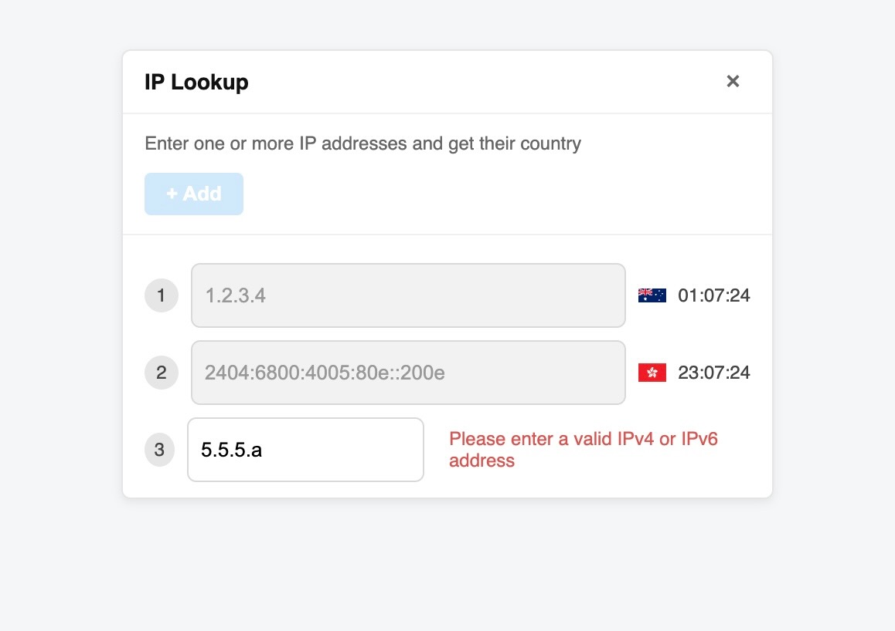

# IP to Country Lookup App

[](https://github.com/yarice/IpToCountry/actions/workflows/test.yml)
[](https://github.com/yarice/IpToCountry/actions/workflows/ci.yml)

A Vue.js application that allows users to look up IP addresses and get their corresponding country information, including flags and local time.

## 🌐 Live Application

**Try it now:** [https://yarice.github.io/IpToCountry/](https://yarice.github.io/IpToCountry/)

The app is automatically deployed to GitHub Pages on every merge to main.

## Features

- **IP Address Lookup**: Enter IPv4 or IPv6 addresses to get country information
- **Real-time Clock**: Displays the current time in the IP's timezone
- **Country Flags**: Shows the flag of the country where the IP is located
- **Single Active Row**: Only one IP row can be edited at a time for focused workflow
- **Smart Validation**: Validates IP addresses with 200ms delay to prevent premature errors
- **Error Handling**: Displays helpful error messages for invalid IPs or API failures

## Screenshots



_The IP Lookup application showing both IPv4 and IPv6 support with country flags and local time displays_

## Tech Stack

- **Frontend**: Vue.js 3 with Composition API
- **Language**: TypeScript
- **Testing**: Vitest with Vue Testing Library
- **Styling**: CSS with modern design patterns
- **Build Tool**: Vite
- **API**: ipwho.is for IP geolocation data
- **CI/CD**: GitHub Actions with automated testing and deployment

## Getting Started

### Prerequisites

- Node.js (v18 or higher)
- Git (for version control)
- npm or yarn

### Installation

1. Clone the repository:

```bash
git clone https://github.com/yarice/IpToCountry.git
cd IpToCountry
```

2. Install dependencies:

```bash
npm install
```

3. Start the development server:

```bash
npm run dev
```

4. Open your browser and navigate to `http://localhost:5173`

## Available Scripts

- `npm run dev` - Start development server
- `npm run build` - Build for production
- `npm run preview` - Preview production build
- `npm test` - Run tests
- `npm run test:watch` - Run tests in watch mode
- `npm run test:coverage` - Run tests with coverage report

## Usage

1. **Add IP Rows**: Click the "+ Add" button to create new IP input rows
2. **Enter IP Address**: Type a valid IPv4 or IPv6 address in any row
3. **View Results**: The app will display:
   - Country name
   - Country flag
   - Current time in that timezone
4. **Edit IPs**: Click on any row to edit the IP address
5. **Close App**: Click the "×" button to close and reset the application

## Features in Detail

### IP Validation

- Supports both IPv4 and IPv6 addresses
- Real-time validation with visual feedback
- Prevents API calls for invalid IPs

### Time Display

- Shows current time in the IP's timezone
- Updates every second
- Automatically starts when a valid IP is entered

### State Management

- Only one row can be active (editable) at a time
- Add button is disabled when a row is being edited
- Clean state management with Vue 3 Composition API

### Error Handling

- **Invalid IPs**: Shows validation error messages
- **Network Errors**: Handles connection failures gracefully
- **API Errors**: Displays specific error messages from the API

## 🚀 CI/CD Pipeline

This project uses GitHub Actions for continuous integration and deployment:

### Automated Checks (on every PR):

- ✅ **Tests**: Runs all unit tests with Vitest
- ✅ **Format**: Validates code formatting with Prettier
- ✅ **Build**: Ensures the application builds successfully
- ✅ **Coverage**: Generates test coverage reports

### Automated Deployment (on merge to main):

- 🚀 **Build**: Creates production build
- 🚀 **Deploy**: Automatically deploys to GitHub Pages
- 🚀 **Live**: Updates the live application at [yarice.github.io/IpToCountry](https://yarice.github.io/IpToCountry/)
